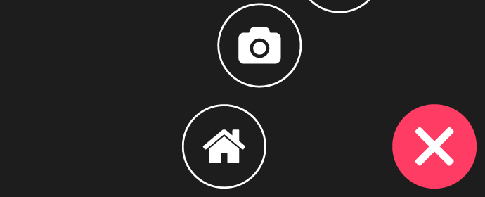

# CSS Circle Fly-Out Navigation

My circular fly-out CSS navigation menu component, built with CSS3. [View the demo here.](http://callmenick.com/_development/css-circle-menu/)



## Usage

To use, include the CSS and JavaScript in your app. Markup your menu like this:

```html
<nav class="c-circle-menu js-menu">
  <button class="c-circle-menu__toggle js-menu-toggle">
    <span>Toggle</span>
  </button>
  <ul class="c-circle-menu__items">
    <li class="c-circle-menu__item">
      <a href="#" class="c-circle-menu__link">
        
      </a>
    </li>
    <!-- more items here -->
  </ul>
  <div class="c-circle-menu__mask js-menu-mask"></div>
</nav>
```

Then, include your script like this:

```html
<script src="path/to/circleMenu.min.js"></script>
```

Finally, you can initialize the menu like this:

```html
<script>
  var el = '.js-menu';
  var myMenu = cssCircleMenu(el);
</script>
```

The default number of menu items is 5. To use a different number of items, you'll have to [configure and build with Sass and Gulp.](#configuring-and-building-with-sass-and-gulp)

### Out of the box usage

You can use this component out of the box by downloading the uncompressed or compressed files from the `css/` directory.

### Use as a Bower component

The component is available as a bower package, and you can import it by running the following command:

```
bower install css-circle-menu
```

## Configuring and Building with Sass and Gulp

The component is built with Sass (SCSS) and uses a JavaScript module as well to handle events. Everything gets compiled and built with Gulp. To develop and compile from gulp, just run:

```
npm install
gulp
```

To watch files during development, run

```
gulp watch
```

Using the Gulp workflow is hugely beneficial, because it makes the component much easier to work with and customise. If you're not using Gulp to compile the Sass, you will still need to leverage Compass to make use of the math helper functions. The following 11 variables are configurable in the Sass up front, and their defaults are written out for you to look at:

```scss
// $menu-item-radius: 48px;                  [1]
// $num-items: 5;                            [2]
// $menu-theme-color: rgb(255, 40, 60);      [3]
// $spread-radius: 144px;                    [4]
// $delay-increment: 0.1s;                   [5]
// $menu-position: "bottom-right";           [6]
// $mq-height: 480px;                        [7]
// $mq-width: 480px;                         [8]
// $button-bar-height: 4px;                  [9]
// $button-bar-spacing: 4px;                 [10]
// $button-lr-padding: 10px;                 [11]
```

You can edit these as you see fit. Here's the breakdown of these 11 configuration options:

1. Set up the initial menu item radius.
2. Decalare how many items our menu will contain.
3. Set up a theme colour.
4. The spread radius, which is how far the menu items spread from the origin.
5. The delay increment, which is how much delay there is between each menu
   item leaving from / returning to the origin.
6. The position of the menu, chosen from one of four values:
       `bottom-right`   - bottom right corner (this is the default)
       `bottom-left`    - bottom left corner
       `top-left`       - top left corner
       `top-right`      - top right corner
7. Minimum height at which menu increases size.
8. Minimum width at which menu increases size.
9. The height of a bar in the toggle button.
10. The spacing between bars in the toggle button.
11. The padding between the left and right of the toggle button container and
    the bars.

Other variables will have to be customised further down in the Sass with your own discretion. Be sure to change up the Sass variable that defines the number of navigation items.

## License & Copyright

Licensed under the [MIT license.](http://www.opensource.org/licenses/mit-license.php)

Copyright 2016, [Call Me Nick.](http://callmenick.com)
